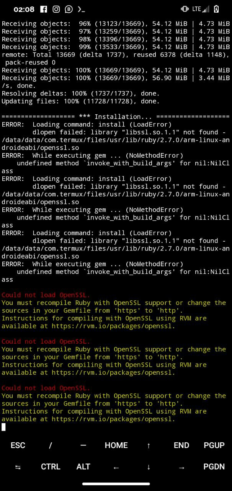

# msfconsole-termux 2022

msfconsole termux error fix

  
  

[msfconsole error termux]

# How to install Metasploit Framework 6 in Termux 2022 uk2blogger

  
  

Step 1 Download termux and termux api from <a href="https://f-droid.org/en/" target="_blank">F-Droid</a>

Download and execute the script
<pre>pkg update; pkg upgrade
pkg install wget curl
cd $HOME;wget https://raw.githubusercontent.com/alvinbaby/msfconsole-in-termux/main/Install.sh -q;bash install.sh </pre>

<pre>rm -rf /data/data/com.termux/files/usr/bin/msfvenom

cd;cd metasploit-framework;ln -s $HOME/metasploit-framework/msfvenom /data/data/com.termux/files/usr/bin/
</pre>

# unsupported (OpenSSL::Cipher::CiPherError)
After installing the Metasploit-Framework 6 in termux copy paste the everything in the home directory
<pre>
cd metasploit-framework;
sed -i '13,15 {s/^/#/}' /data/data/com.termux/files/usr/lib/ruby/gems/3.1.0/gems/hrr_rb_ssh-0.4.2/lib/hrr_rb_ssh/transport/encryption_algorithm/functionable.rb; sed -i '14 {s/^/#/}' /data/data/com.termux/files/usr/lib/ruby/gems/3.1.0/gems/hrr_rb_ssh-0.4.2/lib/hrr_rb_ssh/transport/server_host_key_algorithm/ecdsa_sha2_nistp256.rb; sed -i '14 {s/^/#/}' /data/data/com.termux/files/usr/lib/ruby/gems/3.1.0/gems/hrr_rb_ssh-0.4.2/lib/hrr_rb_ssh/transport/server_host_key_algorithm/ecdsa_sha2_nistp384.rb; sed -i '14 {s/^/#/}' /data/data/com.termux/files/usr/lib/ruby/gems/3.1.0/gems/hrr_rb_ssh-0.4.2/lib/hrr_rb_ssh/transport/server_host_key_algorithm/ecdsa_sha2_nistp521.rb;
clear;echo "Done...."
</pre>

  

    
  

  

    
  

  

    
  

  

    
  

  

    
  

  

    
  

